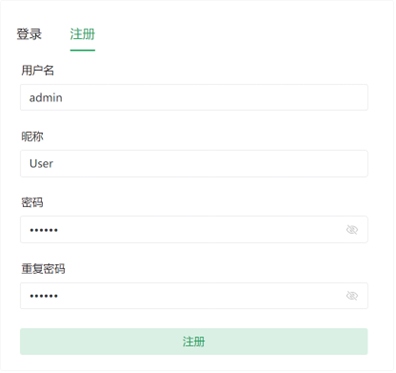
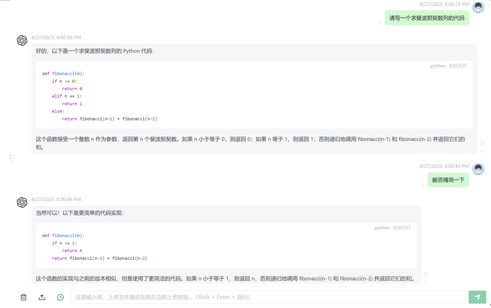
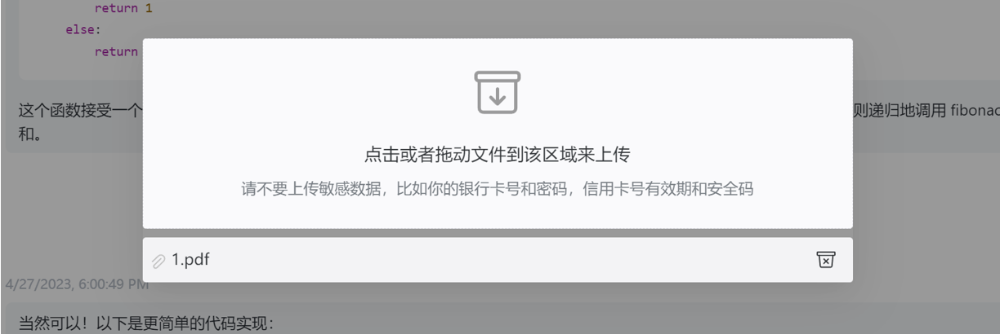
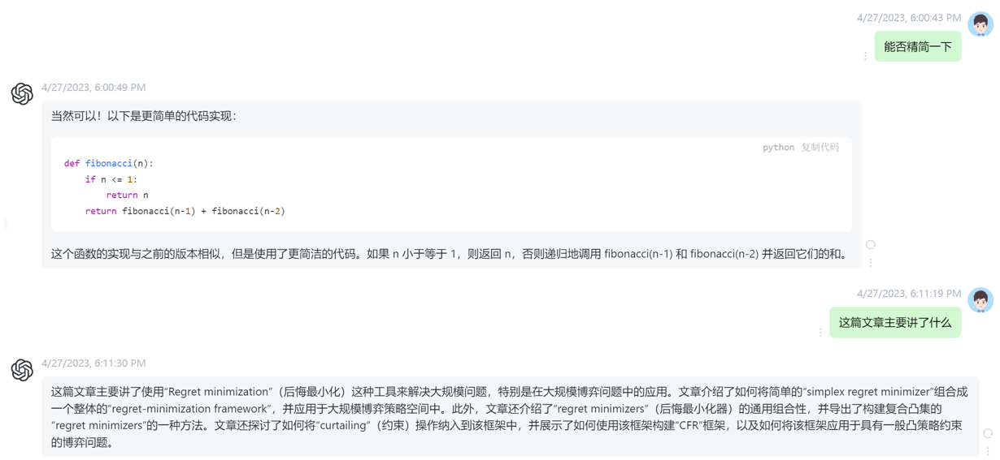
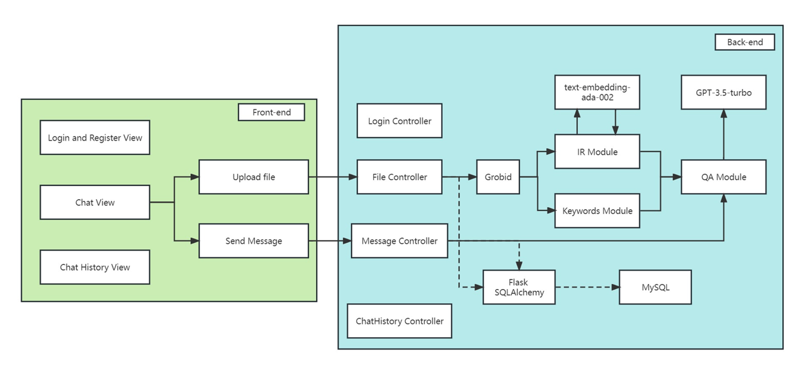

# GPT-pdf

## 介绍

前端采用Vue框架，后端采用Flask框架以及Mysql数据库，完成了基于GPT-3.5-turbo接口的长文本处理项目，用户可以通过上传文档、询问问题的方式得到相应的回答。

### 前端

在[chatgpt-web]('https://github.com/Chanzhaoyu/chatgpt-web/tree/main')基础上进行二次开发，添加了用户注册、登录、上传文档功能，并实现多用户管理






### 后端

后端采用Flask框架以及Mysql数据库，存储了用户消息的历史记录，完成了基于GPT-3.5-turbo和text-embedding-ada-002接口的长文本处理项目，用户可以通过上传文档、询问问题的方式得到相应的回答。



### 运行此项目

#### 运行前端模块
请参照在[chatgpt-web]('https://github.com/Chanzhaoyu/chatgpt-web/tree/main')，使用nodejs运行前端模块

#### 运行后端模块
在chat_model.py 文件下更改
```python
# 设置 API Key，申请地址：https://platform.openai.com/account/api-keys
openai.api_key = '' 
# 设置组织，查看地址：https://platform.openai.com/account/org-settings
openai.organization = ''
```
在back_end文件夹下运行flask程序
```python
cd back_end
python app.py
```
